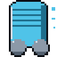
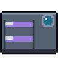
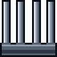
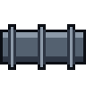
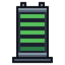
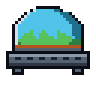
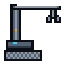
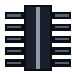
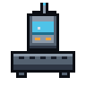
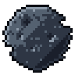

# SPACE STATION — Manuale di gioco

*Manuale operativo di bordo, edizione v0.4 — da leggere prima del primo
turno in cabina di comando. O durante. Nessuno ti giudica.*

---

Benvenuto a bordo, progettista.

Space Station è un gioco di equilibri: costruisci una stazione spaziale su
una griglia, moduli attaccati ad altri moduli, e poi premi Spazio e guardi
se regge. L'energia scorre solo tra celle adiacenti, l'aria basta finché
basta, il calore si accumula in silenzio. Quando qualcosa cede — e
qualcosa cede sempre — i guasti arrivano in fila indiana, e il registro
eventi in fondo allo schermo te li racconta riga per riga.

Il ciclo è tutto qui: **costruisci → avvia → leggi il bilancio → reagisci
al guasto**. Il resto di questo manuale spiega i dettagli; la sostanza è
che ogni numero sullo schermo vuole dirti qualcosa, prima che sia tardi.

---

## 1. Le quattro risorse

| Risorsa | Come funziona |
|---|---|
| **Energia** | Non si accumula (salvo Batterie): a ogni tick la produzione dei reattori si distribuisce ai moduli della stessa rete, in ordine di priorità. Se non basta, i moduli meno critici si spengono. |
| **Ossigeno** | Riserva unica di stazione, da 0 a 100. Sale con i life support (e le serre) attivi, scende di 10 per membro dell'equipaggio a ogni tick. Sotto 30 scatta l'allarme. |
| **Calore** | Quasi tutto scalda; radiatori e condotti dissipano. Un bilancio positivo per 6 tick consecutivi manda in avaria un modulo a caso. |
| **Equipaggio** | Con posti letto liberi e aria buona (riserva sopra 50) arriva una persona ogni 4 tick. Con l'ossigeno a zero, ne muore una ogni 3. |

**La regola d'oro dell'energia**: la corrente non salta il vuoto. Ogni
gruppo di moduli ortogonalmente adiacenti è una **rete**, e una rete senza
reattore funzionante è ferraglia fredda. I corridoi esistono per questo:
un filo di corrente da 1 di energia a cella.

### La cascata di guasti

Il gioco non ti punisce con un colpo solo: ti mostra la catena.

1. **Blackout** — la rete consuma più di quanto produce: i moduli si
   spengono in ordine inverso di priorità (prima i laboratori, per ultimo
   il life support).
2. **Life support giù** — l'ossigeno smette di rigenerarsi; la riserva
   scende di 10 a persona, a ogni tick.
3. **Ossigeno a zero** — l'equipaggio comincia a morire, uno ogni 3 tick.
4. **Equipaggio a zero** — la stazione è persa.

Ogni anello della catena si può spezzare, se te ne accorgi in tempo: il
registro eventi e i badge sui moduli (fulmine = energia, omino = manca
equipaggio, triangolo = avaria) sono lì per quello.

**Tetto dei tick**: in Campagna, Sfida e Livello casuale la partita si
chiude comunque a 400 tick ("TEMPO SCADUTO"). Solo l'Infinita non ha
orologio.

---

## 2. I moduli

Undici moduli: sei disponibili da subito, cinque si guadagnano avanzando
nella campagna (e una volta sbloccati valgono in **tutte** le modalità).
I valori sono *per tick*. La **priorità** dice l'ordine di alimentazione:
0 è servito per primo, 4 si spegne per primo quando la corrente manca.

| | Modulo | Tasto | Energia | Ossigeno | Calore | Note | Priorità |
|---|---|---|---|---|---|---|---|
|  | **Reattore** | 1 | +100 | — | +40 | accende la sua rete | 0 |
|  | **Life Support** | 2 | −30 | +50 | +5 | l'aria per 5 persone | 0 |
|  | **Dormitorio** | 3 | −10 | — | +2 | 4 posti letto | 3 |
|  | **Laboratorio** | 4 | −40 | — | +25 | impegna 2 di equipaggio; senza, non lavora e non consuma | 4 |
|  | **Radiatore** | 5 | −5 | — | −50 | il tuo migliore amico | 1 |
|  | **Corridoio** | 6 | −1 | — | — | collega; si orienta da solo | 2 |
|  | **Batteria** | 7 | 0 | — | +2 | *sblocco: livello 5* | 1 |
|  | **Serra** | 8 | −10 | +20 | +8 | *sblocco: livello 15* | 0 |
|  | **Gru** | 9 | −20 | — | +5 | *sblocco: livello 25* | 4 |
|  | **Condotto termico** | 0 | −15 | — | −90 | *sblocco: livello 35* | 1 |
|  | **Centro comando** | C | −25 | — | +5 | *sblocco: livello 45* | 3 |

### Schede speciali

- **Batteria** — immagazzina fino a **150** di energia: si carica dal
  surplus della sua rete (al massimo 15 per tick) e la restituisce quando
  la rete va in deficit, *prima* che qualunque modulo si spenga. Quando
  l'HUD mostra il margine energia in negativo ma niente è in blackout,
  stai andando a batteria: goditi il tempo comprato, ma compra anche un
  reattore.
- **Serra** — fa più ossigeno per unità di energia del life support (2,0
  contro 1,67) ma meno per cella, e scalda parecchio. Ottima per
  allungare l'aria in fondo a una rete lunga.
- **Gru** — piazzala **adiacente a un detrito** e tienila accesa: dopo 12
  tick di lavoro consecutivi rimuove il detrito e si smonta da sola. Due
  celle libere al prezzo di un modulo. Se si spegne a metà, il contatore
  riparte da zero; se non ha detriti vicini, consuma e basta.
- **Condotto termico** — dissipa quasi come due radiatori in una cella
  sola, ma beve il triplo della corrente. Per stazioni dense.
- **Centro comando** — **massimo uno per stazione**: con lui attivo i
  nuovi arrivi passano da uno ogni 4 tick a uno ogni 2. Il comando non si
  divide.

### I detriti

Rocce alla deriva che occupano celle della griglia: non ci si costruisce,
non si rimuovono (tranne che con la Gru). Non consumano niente e non
fanno niente — ti tolgono solo lo spazio, che a fine campagna è la
risorsa più preziosa di tutte. Il log ti avvisa quando ci sono:
*"Detriti sulla griglia: costruisci intorno"*.

---

## 3. La storia e l'equipaggio

### La storia

Nel settore K, dove costruisci, orbita da dieci anni quel che resta di
un'altra stazione. L'equipaggio la chiama "la Vecchia", con l'affetto
storto che si riserva ai morti di famiglia — e quelle rocce su cui
serpeggi coi corridoi non sono soltanto sassi. Il gioco lo racconta per
gradi: ai livelli **1, 11, 21, 31 e 41** compare un **diario di bordo**
(la prima volta che ci arrivi), una pagina a testa per chi ha qualcosa da
dire; le battute dei briefing fanno il resto, una scheggia per volta,
fino a un finale che chiude i conti di tutti. Chi vuole la mappa completa
degli archi la trova in `STORIA.md` — ma è più bello scoprirla giocando.

### L'equipaggio

Cinque persone ti accompagnano per tutta la campagna: nei briefing di
**ogni** livello parla uno di loro, e a ogni traguardo uno ti consegna un
modulo nuovo. Sono tutti, per motivi propri, legati alla Vecchia.
Ascoltali: sotto la battuta c'è sempre un'istruzione — e sotto
l'istruzione, quasi sempre, un ricordo.

###  Vera — Ingegnera di bordo

**Passato.** Dieci anni fa era di turno in una sala macchine di cui non
parla mai direttamente — e di cui parla sempre, se fai caso a come
tratta il calore. Nessuno le ha mai dato una colpa; lei non ha mai
accettato l'assoluzione.
**Carattere.** Sarcasmo da officina, tenerezza per le macchine ("riparala,
e chiedile scusa da parte mia"). Ride dei propri progetti, dell'orgoglio
degli ingegneri e della burocrazia del centro; non ride mai del calore.
**Nella campagna.** Padrona di casa dei blocchi dei reattori (6–10) e
delle stazioni dense (31–35); ti consegna la **Batteria** al livello 5 —
per lei è "tempo comprato" — e il **Condotto termico** al 35, il suo
progetto riabilitativo.

> «Qui dentro fa caldo come in sala macchine, quella notte. Lo dico da
> sola, piano: non finirà allo stesso modo.»

###  Tomas — Medico di stazione

**Passato.** Ha tenuto un registro, una volta, in cui i conti non
tornavano più: da allora conta tutto — respiri, letti, arrivi — come se
contare fosse una forma di preghiera.
**Carattere.** Fatalista gentile, umorismo da obitorio e mani da
pediatra. Ride delle diagnosi noiose e delle pagine bianche del suo
registro; non ride mai dei nomi.
**Nella campagna.** Padrone di casa dei blocchi dell'aria e degli
incidenti (11–20), la coscienza sanitaria di ogni ondata di coloni; ti
consegna la **Serra** al livello 15 — la chiama "prescrizione verde".

> «Gli incidenti capitano. Quello che conta è chi respira dopo.»

###  Dario — Caposquadra

**Passato.** Sei anni di turni su una stazione che oggi non c'è più:
conosce quelle rocce là fuori molto meglio di quanto ammetta, e per
mezza campagna preferisce costruirci intorno piuttosto che guardarle.
**Carattere.** Misura tutto, borbotta sempre, vuole bene alla squadra in
modo ruvido e totale. Ride delle lamentele in mensa e dei propri
borbottii; non ride mai delle scelte che ha dovuto fare altrove.
**Nella campagna.** La voce del cantiere: apre il livello 1, guida i
blocchi dei detriti e della crescita (21–30); ti consegna la **Gru** al
livello 25 — il giorno in cui smette di girare attorno alle macerie,
letteralmente e no.

> «Non farmi scegliere chi dorme in corridoio. L'ho già fatto una volta,
> su un'altra stazione. Non lo rifaccio.»

###  Mira — Scienziata capo

**Passato.** Ufficialmente è a bordo per i laboratori. In realtà
cataloga i frammenti là fuori con un'attenzione che alle rocce non
servirebbe — e per metà campagna tiene per sé quello che va scoprendo.
**Carattere.** Precisa, riservata, di un'onestà che non fa sconti
nemmeno a se stessa. Ride (poco) della retorica del centro; non ride mai
dei numeri, perché sa cosa costano.
**Nella campagna.** Padrona di casa del blocco dei laboratori (36–40);
non consegna moduli: consegna qualcosa che vale di più, a metà campagna,
e cambia il modo in cui guarderai il punteggio.

> «Ogni punto in archivio è un'ora della vita di qualcuno. Spendili come
> se costassero. Costano.»

###  Ilse — Comandante

**Passato.** C'è chi la chiama ancora "quella che ha perso una
stazione". Lei non corregge nessuno: sa contare meglio di tutti quello
che invece ha salvato.
**Carattere.** Voce del comando: asciutta, mai un aggettivo di troppo,
gli ordini che sembrano preghiere e viceversa. Ride quasi solo per
iscritto, nel diario; non ride mai della parola "evacuazione".
**Nella campagna.** Apre e chiude tutto: il primo diario di bordo è suo,
l'ultimo pure. Guida i blocchi finali (41–50) e ti consegna il **Centro
comando** al 45. L'ultima battuta della campagna, prima del finale, è
sua: *«Ultimo settore. Tutto quello che sai, tutto insieme. Portaci a
casa.»*

> «Da oggi vietata la parola 'avamposto'. Si chiama casa. E le case non
> si evacuano: si difendono.»

---

## 4. Le modalità di gioco

| Modalità | Obiettivi | Tetto tick | Classifica |
|---|---|---|---|
| **Campagna** | 50 livelli in sequenza | 400 | no (progressione) |
| **Infinita** | nessuno: resisti | nessuno | top 10 Infinita |
| **Sfida** | nessuno: punti entro il tempo | 400 | top 10 Sfida |
| **Livello casuale** | uno generato al momento | 400 | no |

Il **punteggio** è persone·tick: a ogni tick guadagni tanti punti quante
persone respirano a bordo. Infinita e Sfida hanno classifiche separate
apposta: senza tetto di tick, l'Infinita vincerebbe sempre solo durando.

Tutto si salva in file di testo semplici in
`~/.local/share/space-station/` (o `$XDG_DATA_HOME/space-station/`):
`classifica.txt`, `classifica_sfida.txt`, `progressione.txt`. Cancellarli
azzera solo quello che contengono, niente di peggio.

### La campagna in breve

Cinquanta livelli: i primi 6 disegnati a mano (uno per meccanismo), dal 7
in poi generati con seed fisso — il livello 23 è il livello 23 per tutti.
Ogni livello ha un obiettivo, spesso dei detriti, e un **budget di
moduli** (corridoi inclusi) mostrato nel briefing e nell'HUD: a budget
esaurito si rimuove col tasto destro e si riorganizza. Ogni dieci livelli,
ai traguardi 5, 15, 25, 35 e 45, si sblocca un modulo nuovo — ed è lì che
i livelli cominciano a pretenderlo. Nella griglia di selezione le frecce
su/giù saltano di riga, sinistra/destra di casella.

All'avvio del livello la griglia si oscura e il personaggio di turno ti
accoglie con un **fumetto a tutto schermo**: "Avanti" mostra l'obiettivo,
"Gioca!" ti lascia al cantiere.

**Il tempo è una risorsa.** Il tetto della partita si legge come un
**timer** nell'HUD (`TEMPO 4:40`, che ingiallisce e poi arrossisce), e la
velocità paga: completare il livello entro il **40%** del tempo vale la
**medaglia d'oro**, entro il **70%** l'**argento**, entro il limite il
**rame**. La medaglia colora il numero del livello nella griglia di
selezione (oro, bianco-argento, ruggine) e frutta **crediti** per il
Marketplace — una tantum, solo quando migliori: rame 1, argento 2, oro 3.
Pochi, di proposito.

---

## 5. Il Marketplace e le scorte

Dal **titolo** si apre il **Marketplace**: il catalogo delle facilities,
che si compra coi **crediti delle medaglie** (§4). Quello che compri
diventa **scorta** persistente; in partita premi **M** (o il bottone
SCORTE nell'HUD) per aprire l'inventario e **usare** una scorta — che si
consuma. Le scorte senza senso nel contesto (l'ampliamento stiva dove non
c'è budget, la sonda senza detriti) restano in magazzino, spente.

*Nessuna valuta reale, nessuna transazione: i crediti si guadagnano solo
giocando, tutto è gratis nel mondo vero.*

| Facility | Costo (crediti) | Effetto |
|---|---|---|
| **Scorta d'ossigeno** | 2 | riserva d'ossigeno subito al massimo |
| **Spurgo termico** | 2 | azzera il surriscaldamento accumulato |
| **Squadra di riparazione** | 3 | ripara tutte le avarie in un colpo |
| **Ampliamento stiva** | 3 | +2 al budget moduli *(usabile solo nei livelli col budget)* |
| **Trasporto coloni** | 4 | +2 equipaggio subito, se ci sono posti letto |
| **Sonda demolitrice** | 5 | rimuove il detrito più vicino al centro *(usabile solo se ci sono detriti)* |

I crediti sono pochi e i prezzi cattivi, di proposito: una scorta ti
risolve mezzo livello, deve costare mezze campagne.

---

## 6. Comandi

| Input | Effetto |
|---|---|
| `1`–`6` | seleziona un modulo base |
| `7` `8` `9` `0` `C` | seleziona uno sbloccabile (Batteria, Serra, Gru, Condotto, Centro comando) |
| click sulla palette | come i tasti |
| click sinistro | costruisce sulla cella |
| click destro | rimuove il modulo sulla cella |
| `R` | ripara il modulo in avaria sotto il cursore |
| `Spazio` | avvia/ferma la simulazione (da fermi si costruisce senza conseguenze, l'HUD mostra l'anteprima) |
| `M` | apre le scorte comprate nel Marketplace |
| `Esc` | menu di pausa (congela anche il tempo) — anche col bottone MENU nell'HUD |
| frecce + `Invio` | navigano i menu |
| frecce nella griglia livelli | su/giù cambia riga, sinistra/destra cella |

---

## 7. L'audio

Ogni suono della stazione è generato da uno script (`tools/gen_audio.py`),
come gli sprite: onde quadre e triangolari, niente registrazioni. La
grammatica è semplice e vale ovunque: **il verso del suono racconta
l'evento** — sale per le cose che crescono (costruzioni, nuovi arrivi),
scende per quelle che finiscono (rimozioni, sconfitte). Gli allarmi
suonano i **passaggi** di stato, mai gli stati: se senti l'allarme una
volta, qualcosa è appena peggiorato; se non lo senti più, non è detto che
vada tutto bene — è detto solo che non sta peggiorando. Il registro
eventi resta l'unica fonte completa: l'audio ti gira la testa verso lo
schermo, il log ti dice cosa guardare.

C'è anche una **colonna sonora** (generata anch'essa da script,
`tools/gen_musica.py`): una traccia per il titolo e sei tracce di gioco
che **seguono la storia** — in campagna ogni blocco di livelli ha la sua
(dal cantiere speranzoso dei primi livelli alla traccia ampia del finale,
passando per la malinconia dei blocchi in cui i detriti si rivelano per
quello che sono). In Infinita, Sfida e Livello casuale la traccia viene
pescata a caso a inizio partita. Dal **menu di pausa** (`Esc`) regoli o
azzeri separatamente *Musica* ed *Effetti* a passi del 25%; la scelta è
ricordata tra una sessione e l'altra.

---

## 8. Consigli di sopravvivenza

1. **Un radiatore prima del secondo reattore.** Due reattori sono +80 di
   calore: il surriscaldamento perdona 6 tick, poi rompe qualcosa a caso
   — magari proprio un radiatore.
2. **Conta l'aria: 10 a testa.** Un life support regge 5 persone, non
   una di più. Se i posti letto superano l'aria disponibile, stai
   costruendo la coda per l'obitorio.
3. **Il corridoio è il modulo migliore del gioco.** 1 di energia per
   portare la corrente ovunque. Quando il budget stringe, sostituire
   moduli con corridoi ben piazzati è quasi sempre la risposta.
4. **I laboratori si spengono da soli, e va bene così.** In blackout
   cadono per primi (priorità 4): è il gioco che protegge il life
   support. Non ricostruirli: ricollegali.
5. **La Batteria non produce niente — e vince partite.** Un picco di
   consumo (il laboratorio che si riattiva, l'avaria del reattore
   gemello) si assorbe con 150 di carica. Guarda `batt` nell'HUD.
6. **Riparare è gratis, accorgersene no.** Il tasto `R` sistema
   un'avaria all'istante: il costo vero è il tempo in cui il modulo è
   rimasto fermo senza che te ne accorgessi. Leggi il registro eventi.

---

*Le immagini di questo manuale sono generate da `tools/gen_docs_img.py`
a partire dalle stesse mappe ASCII degli sprite di gioco
(`tools/gen_sprites.py`). Se i numeri del bilanciamento cambiano
(`src/modules.rs`, `src/sim.rs`), il manuale va aggiornato a mano —
questo è il prezzo della carta stampata.*
